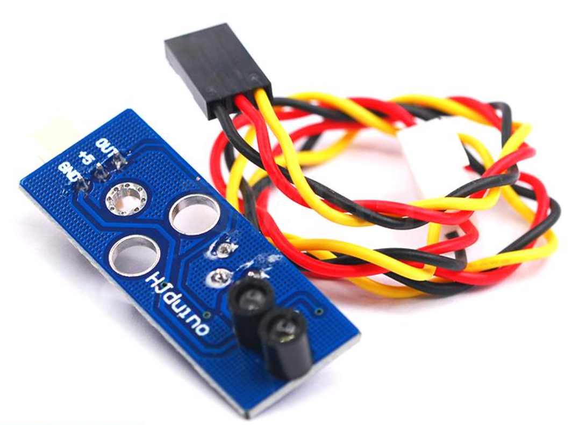
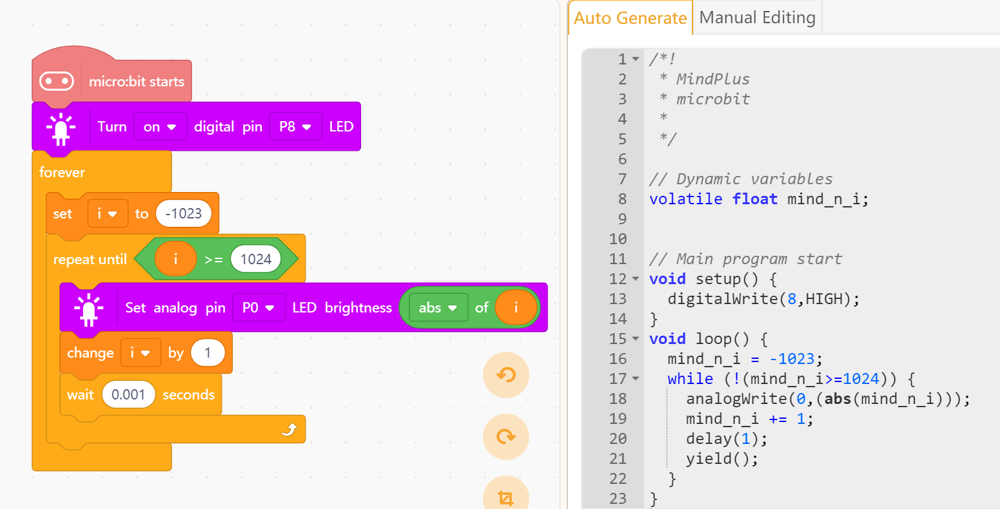

# LED_Light

## Description
Mars:Lab          LED Light Moudle

LED Light Module Controlled by Digital/Analog Pin

## Software 
Program with mind+

## Blocks 

## Example

## Challenge

## License

MIT

## Support mode

micro:bit Offline

## Update Notes
* V0.0.1  Completion of basic functions

## Contributions
1.  MarsCollege Creating the Led_light Blocks

## About Us

[WorldShaper](http://www.worldshaper.cn/).
[MarsCollege](http://www.marscollege.cn/).