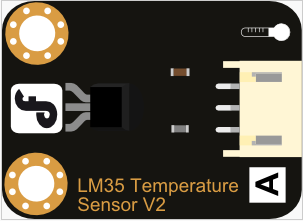

# LM35线性温度传感器




---------------------------------------------------------

## 目录

* [相关链接](#相关链接)
* [描述](#描述)
* [积木列表](#积木列表)
* [示例程序](#示例程序)
* [许可证](#许可证)
* [支持列表](#支持列表)
* [更新记录](#更新记录)

## 相关链接
* 本项目加载链接: ```https://gitee.com/csq5277/ext--LM35.git```

* 用户库教程链接: ```https://mindplus.dfrobot.com.cn/extensions-user```

* 购买此产品: [商城](https://www.dfrobot.com.cn/).

## 描述
LM35线性温度传感器用户库，用于mindplus图形化编程软件。

## 积木列表


## 示例程序


## 许可证

MIT

## 支持列表

主板型号                | 实时模式    | ArduinoC   | MicroPython    | 备注
------------------ | :----------: | :----------: | :---------: | -----
micro:bit        |             |       √       |             | 
mpython        |             |        x      |             | 
Arduino        |             |        √     |             | 

## 更新日志
* V0.0.1  时间：2020/03/16    基础功能完成
* V0.0.2  时间：2020/03/16 根据Mind+V1.6.2 RC2.0更新此库
* V0.0.3  时间：2020/03/17 修改microbit引脚下拉